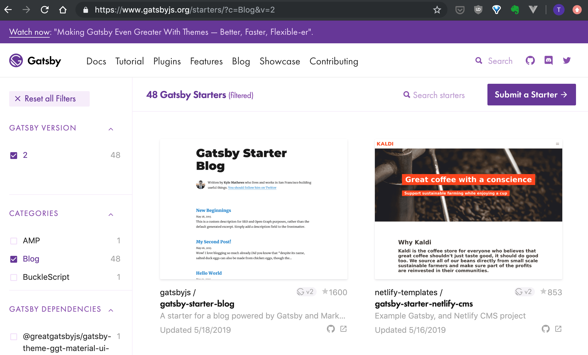
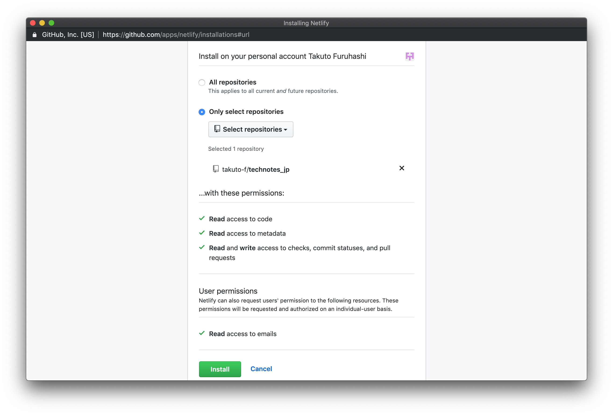
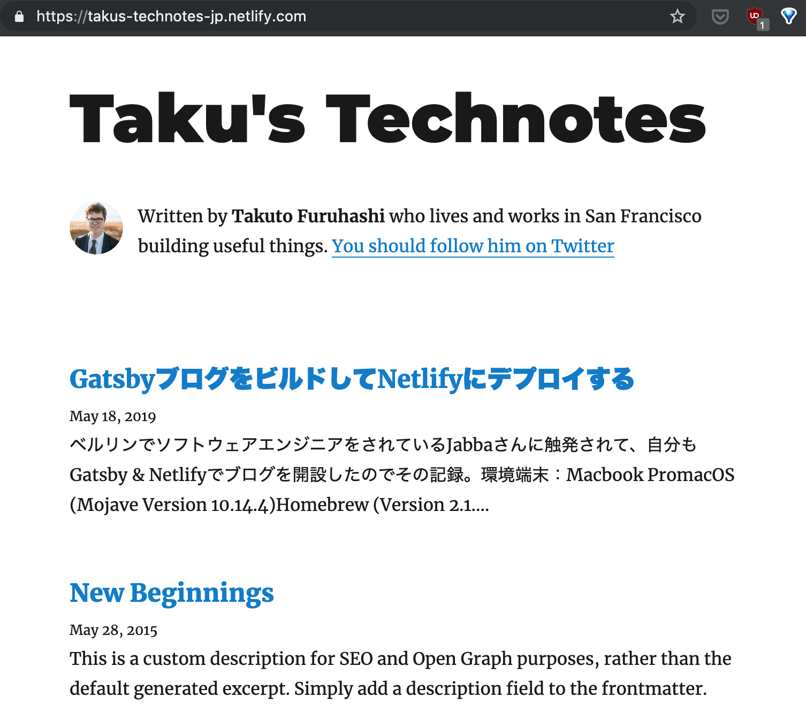

[ベルリンでソフトウェアエンジニアをされているJabbaさんに触発](https://www.jabba.cloud/20190113194504/)されて、自分もGatsby & Netlifyでブログを開設したので、その記録。

# 環境

端末：Macbook Pro

*   macOS (Mojave Version 10.14.4)
*   Homebrew (Version 2.1.2)
    *   nvm (Version 0.34.0)
        *   Node.js (Version 10.15.3)  
        *   npm (Version 6.9.0)

# Gatsbyのチュートリアルは必須ではない

[Gatsbyのチュートリアル](https://www.gatsbyjs.org/tutorial/)（ボリューム多くて挫折しましたorz）をやっていないGatsby初心者でもサイト構築してデプロイできます。
この辺はHUGOと一緒ですね。
ちなみに自分はReact初心者どころかJS初心者で、ifとforと関数が使える程度のレベルです。

# Gatsbyをインストール

    npm install -g gatsby-cli

# ローカル環境でサイトを構築

[Gatsby Starterの一覧](https://www.gatsbyjs.org/starters/?c=Blog&v=2)から好きなものを選んで、ローカルに持ってきます。



自分は参考にしたサイトと同じ gatsby-starter-blog を使い、technotes という名前のサイトを作ることにしました。
（あとで検索機能を入れたり、著者の表示を消したりなどカスタマイズしたいです）

    gatsby new technotes https://github.com/gatsbyjs/gatsby-starter-blog

これで technotes というディレクトリが作成されて、その中にStarterがダウンロード・インストールされます。

ディレクトリに入り、ローカルでサイトをビルドしてみます。

    cd technotes
    gatsby develop

これで、ローカル環境に開発用サーバが立ち上がり、ブラウザで出来ばえを確認できます。

## 記事の作成

`content/blog`ディレクトリにMarkdownファイルを追加すると記事が生成されます。
サブディレクトリを作ってMarkdownファイルを置いた場合も記事生成されるようです。

HUGOだと、`hugo new`コマンドを使って、Markdownファイルの作成とFrontmatterの生成を一括してできたのですが、Gatsbyは手動でやらなければならずちょっと面倒ですね。。

# Netlifyでデプロイ

Githubでリポジトリを作ってサイトのソースファイルをプッシュしておくと、Netlifyでのデプロイが簡単にできます。

## Gitにコミット

サイトのファイル全体をGitにコミットします。

    （technotesディレクトリに移動）
    git init
    git add .
    git commit -m "First commit"

## Githubにプッシュ

Githubにリポジトリを作って、ローカルリポジトリからプッシュします。

    git remote add origin https://github.com/takuto-f（ユーザ名）/technotes_jp（リポジトリ名）
    git push -u origin master

## Netlifyでデプロイ

[Netlifyにアクセス](https://app.netlify.com/signup)してGithubアカウントでサインアップします。
New site from Gitのボタンから、サイトのソースファイルがあるGithubリポジトリをインストール（Netlifyに登録）します。
デプロイの設定はいじりませんでした。



しばらくするとデプロイされ、サイトをネット上で確認できるようになります。



※サイトURLは、ランダムの文字列が自動で割り当てられます。Netlifyの設定から変更できます。

# デプロイ用のスクリプトを作成

サイトを更新するために、「Gitにコミット→Githubにプッシュ」作業を繰り返すのは面倒なのでシェルスクリプトにまとめましょう。

```shell
#!/bin/bash

echo -e "\033[0;32mDeploying updates to GitHub...\033[0m"

# Build the project.
#hugo # if using a theme, replace with `hugo -t <YOURTHEME>`
gatsby build

# Add changes to git.
git add .

# Commit changes.
msg="rebuilding site `date`"
if [ $# -eq 1 ]
then msg="$1"
fi
git commit -m "$msg"

# Push source and build repos.
git push origin master

```

# 所感

[HUGOで作ったブログ](https://takuto-f.github.io)と比べての感想になりますが、「ビルドが遅く、サイトは速い」印象です。
（厳密に測定したわけではありません。というか測り方知らないです）

あと、ブログテンプレートはHUGOの方が好みのものが多かったです、個人的に。
JSおよびReactの勉強も兼ねてしばらくGatsbyを使ってみるつもりですが、しばらくしたらHUGOで作り直すかも。

# 今後のタスク

書き連ねたらけっこう盛りだくさんになりました。

*   著者情報の変更、削除
    *   プロフィール画像をいつまでもイケメンのKyle Mathews氏にしておくのはマズい
    *   サンフランシスコで働いていると書くのは経歴詐称になる
*   フォントの変更
    *   ブログタイトルや大見出しのフォントが太すぎて美しくない（好きくない）
*   コードブロックの背景色の変更
    *   どこがコードかわかりにくいので
*   コードおよびコードブロックのフォントの変更
    *   スペースが狭すぎて読みづらく感じる
*   タグの表示＆タグページの作成
*   検索窓の実装
*   ヘッダーまたは「上に戻る」ボタンの実装
*   シンタックスハイライトの実装
*   リストを入れ子にしたときのリストマーカーの変更
*   ファビコンの変更
*   README.mdの変更

# 参考

[Start a Blog in 2019 with Gatsby.js and Netlify](https://daveceddia.com/start-blog-gatsby-netlify/)